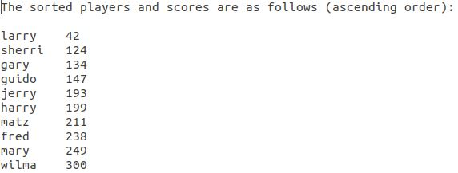

Portfolio
=========

Programming Projects
--------------------

*For access to my private project repositories, please [email me](mailto:erpowell@csustudent.net?subject=GitHub%20Access) with the subject line, GitHub Access.

---
### [Perl Hash Table with File Reading and Writing | CSCI 301](project2)

---
### [Student ID Map | CSCI 315](project1)

---
### [RPG Team Project | CSCI 325](project3)

---
### [League Multiplayer Project | CSCI 332](project4)

---

Ethics Papers
-------------

### [Bug Testing - The Modern Dilemma](/pdf/Bug_Testing-The_Modern_Dilemma.pdf)

-   **Class: CSCI 315**  
-   **Grade: 100.00**

### [Code Plagarism](/pdf/Code_Plagarism.pdf)

-   **Class: CSCI 325** 
-   **Grade: 100.00**

### [Copywright - A Question of Ethics](/pdf/Copywright-A_Question_of_Ethics.pdf)

-   **Class: CSCI 301** 
-   **Grade: 100.00**

---

Presentations
-------------

### [What is Cloud Storage](/pdf/Cloud_Storage.pdf)

- **Class: CSCI 405** 
- **Grade: 100.00**

### [The Equifax Breach](/pdf/Equifax_Breach.pdf)

- **Class: CSCI 301** 
- **Grade: 100.00**

---

Page template forked from <a href="https://github.com/csu-cs/csci-portfolio">CSU-CS</a>

<!-- Remove above link if you don't want to attributive -->
