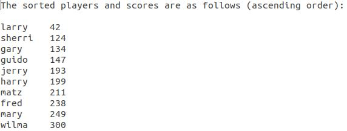
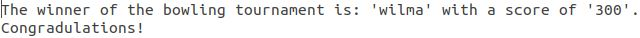

[Back to Portfolio](./)

Student ID Map
===============

-   **Class: CSCI 301** 
-   **Grade: 100.00**
-   **Language(s): Perl**
-   **Source Code Repository:** [Epowell50/Survey_Project](https://github.com/Epowell50/Epowell50-Survey_Perl_Project)  
    (Please [email me](mailto:erpowell@csustudent.net?subject=GitHub%20Access) to request access.)

## Project description

This project is a small script used to read scores from a text file and then does several operations, including averaging, sorting, and finding the largest value.
This program implements a hash table to store values based on a key, the name of the individual, and associates the name with a score, in this case a bowling score.
First, the program reads from a text file known as "Scores.txt". This file must be formatted in a "name score\n" format with the name and its associated score separated
by a space. Secondly, The program takes all the names in the "Scores.txt" file and averages the scores into one output file known as "Averages.txt". 
Thirdly, the program takes all of the scores and sorts them in ascending order by score and outputs them into a "Sorted.txt" file.
Finally, the program takes the largest score and outputs a "Congradulations" with the individual's name and associated score and outputs it to a "Winner.txt" file.

## How to compile / run the program

How to compile (if applicable) and run the project.

```bash
cd /project
./lab04.pl
```

## UI Design

The program has no UI as it is meant as an exercise in perl structure and coding. The program is simple in its operation as it reads from a text file and outputs to output files.
The first operation of sorting can be seen in figure 1 below. This is the output after sorting the scores in an ascending order. This program utilizes a hash table to store names and associate them with a score.
The second operation of averaging can be seen in figure 2 below. This is the output after averaging all scores together.
The thrid opertaion of congradulations can be seen in figure 3 below. This is the output after deciding the largest value, congradulating the "winner" on their high score.


Fig 1. The output after sorting the values in ascending order according to score.


Fig 2. The output after averaging the scores together in a total average score for all individuals.


Fig 3. The output after deciding the largest score and congradulating the winner.

## 3. Additional Considerations

This was an exercise in perl script, using a hash table, and reading to and from files. This program is simple, but includes many aspects of a scripting language and emphasizes the write once and run anywhere aspect of scripting languages.

For more details see [GitHub Flavored Markdown](https://guides.github.com/features/mastering-markdown/).

[Back to Portfolio](./)
