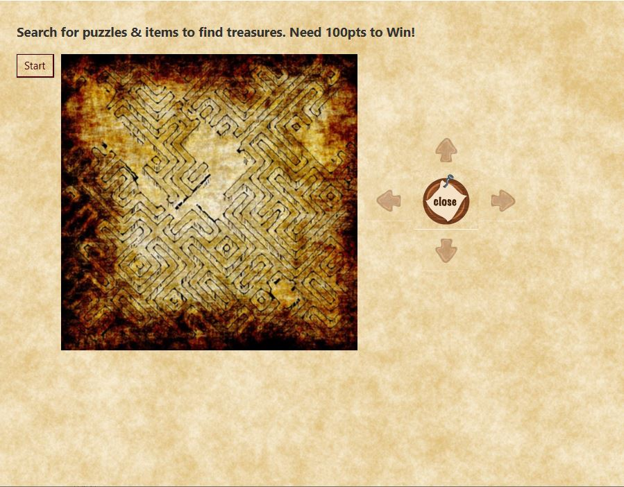
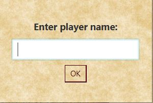
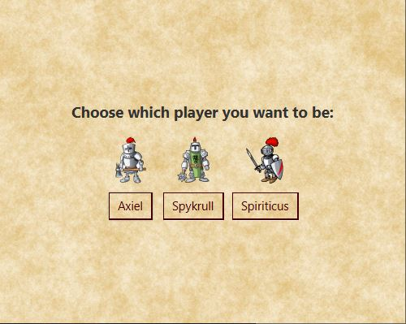
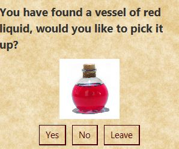
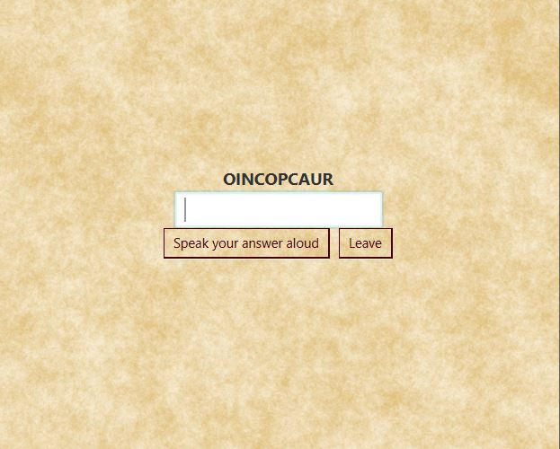
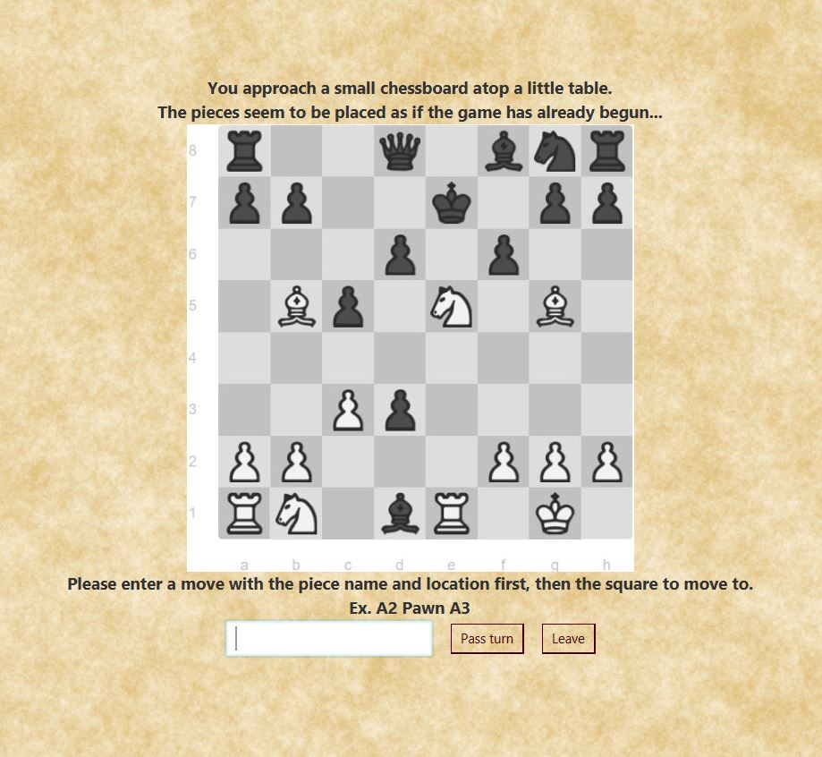
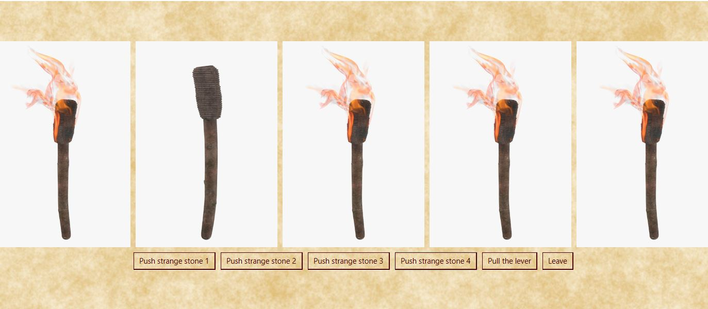
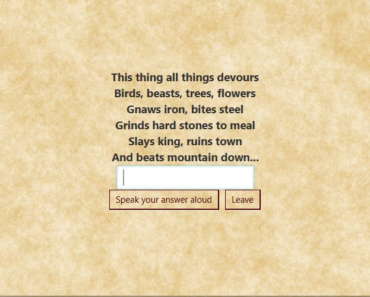
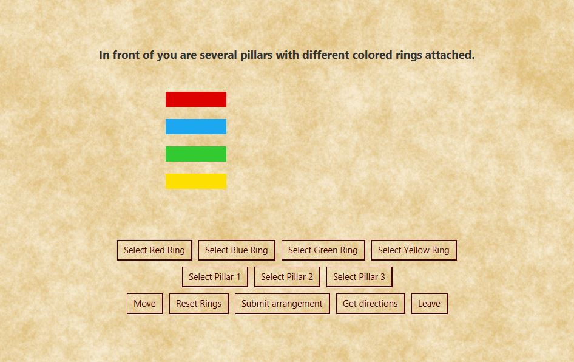
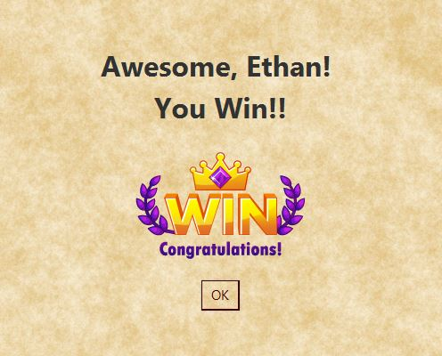

[Back to Portfolio](./)

RPG Team Project
===============

-   **Class: CSCI 301** 
-   **Grade: 100.00**
-   **Language(s): Perl**
-   **Source Code Repository:** [Epowell50/Survey_Project](https://github.com/Epowell50/Epowell50-Survey_Perl_Project)  
    (Please [email me](mailto:erpowell@csustudent.net?subject=GitHub%20Access) to request access.)

## Project description

This project is a very large program that involved a total of 3 contributors Jeanie Harold, Steven Yeung, and myself. Each contributor was responsible for a portion
of the project and contributed to the final result of a playable RPG game that involved puzzle solving and points. I was responsible for coding the puzzles of the RPG.
There were 5 puzzles in total: A chess puzzle, a ring puzle, a torch puzzle, a riddle puzzle, and an anagram puzzle. Each puzzle was self contatined and became displayed
on the screen when a player stepped on a puzzle spot on the gameboard. When prompted, the player could attempt to solve the puzzle now or come back later. When a player
solved a puzzle, they were granted 25 points. Once a player collected 100 points, they win the game and the program waits to be closed to be reset.

## How to compile / run the program

How to compile (if applicable) and run the project.

Step 1: Install NetBeans IDE version 8.1 or later
Setp 2: Download all files from github repository and place in 1 folder
Step 3: Launch NetBeans IDE and select "open project"
Step 4: Navigate to the project folder
Step 5: Open project
Step 6: Click Run

## UI Design

This program is very UI interactive and supports a full, clickable user interface. When a player first lauches the game they will be greeted with a start screen
that displays the direction and goal of the game with a "Start" butotn (See figure 1). Once a player clicks start, they will be prompted to enter their name (See figure 2).
Once a player enters their name, they will then be prompted to select a character (See figure 3). When a player selects a character, they will be placed on the board and be
allowed to navigate the board using the arrow buttons on the right side of the screen. A player at any time may click the "Close" button to exit the program early. As a player moves around the room, they may find items (See figure 4) or puzzles (See figure 6 - 10). The game run consists of the player moving around the room finding items and solving puzzles to collect enough points to "escape" and win (See figure 5). There are five puzzles in total. The first puzzle is an anagram puzzle that requires the player to descramble a series of letters to form a word (See figure 6). Once a player clicks submit, if their answer is correct, the puzzle will change to a "Solved" state and points
will be added to their total. The second puzzle is a chess puzzle. This puzzle requires the player to make the next two correct moves in a chess game in order to reach checkmate
in order to solve the puzzle (See figure 7). The third puzzle is a torch puzzle. This puzzle requires the player to click buttons in the correct order in efforts to light all
torches at one time (See figure 8). The fourth puzzle is a riddle puzzle. This puzzle requires the player to solve a riddle and answer by typing in the correct word (See figure 9). Lastly, the final puzzle is a ring based puzzle where you may not move a ring if another ring is on top. If you try to move a ring to an illegal spot, the rings will reset (See figure 10). Once the player has gained enough points, the player wins and may close the program (See figure 11). Credit to Jeanie Harold for UI, Puzzle interaction, and Item interaction. Credit to Steven Yeung for Item Creation.

Fig 1. The opening screen for the game.

Fig 2. The player name enter screen.

Fig 3. The player selection screen

Fig 4. The view of the user when they find an item.

Fig 5. The view when the game is running.

Fig 6. The anagram puzzle view.

Fig 7. The chess puzzle view.

Fig 8. The torch puzzle view.

Fig 9. The riddle puzzle view.

Fig 10. The ring puzzle view.

Fig 11. The program when the user completes the game and receives the "You Win!" screen.

## 3. Additional Considerations

This was an extensive team project that required the help of everyone invovled. This provided an excellent exprience that allowed
me to gain experience in working in a team. I learned valuable communication skills and how to operate in a team programming enviroment through this project. Again, Credit to the respective contributors and their contributions.

For more details see [GitHub Flavored Markdown](https://guides.github.com/features/mastering-markdown/).

[Back to Portfolio](./)
