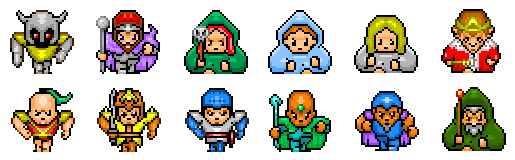

[Back to Portfolio](./)

League Multiplayer Project
===============

-   **Class: CSCI 332** 
-   **Grade: 85.00**
-   **Language(s): C++, C**
-   **Source Code Repository:** [Epowell50/Networking_Project](https://github.com/Epowell50/Epowell50-Networking_Project)  
    (Please [email me](mailto:erpowell@csustudent.net?subject=GitHub%20Access) to request access.)

## Project description

This project was a group assignment to create a game that can network with other devices and allow for LAN network multiplayablitly. The project was a "Battle Royale" style
game where many people would join and then attempt to fight by "hitting" players that were nearby and reducing their healthbars. When a player's healthbar was completely
reduced, they were removed from the game. This, however, does not stop you from rejoining the game if you fail. The goal of the game is to be the last player standing.

## How to compile / run the program

How to compile (if applicable) and run the project.

```bash
cd /project
g++ League.cpp -o Run.exe
./Run.exe
```

## UI Design

This program is very UI ineffecient and only has basic functions. A player selection area, a fight area, and a hit icon when another player is hit. A player must first enter the
broadcast IP into the program to "join" the game. Once there, a player must select the character that they wish to represent them (See figure 1). Once a character is selected, you
are put into the game and allowed to play. The characters move around the screen automatically and the only interaction available is the "hit" function done by pressing different
letters on the keyboard. When a player is hit, a "hit" image is displayed and the removed to show a successful hit (See figure 2). The game can be quit at any time by ending the
process through CTRL+C, or clicking the "X" at the top right of the window.


Fig 1. The character selection screen


Fig 1. The hit image when a character has been hit.

## 3. Additional Considerations

This project was very difficult, as most of the code was given to us without much explination on how it worked. We were only to edit small portions of the code that we were
assigned, causing the programming flow to be very choppy and not very informative. I learned from this project that it is best to understand the code its entirety before
one is able to work on code effectively.

For more details see [GitHub Flavored Markdown](https://guides.github.com/features/mastering-markdown/).

[Back to Portfolio](./)
